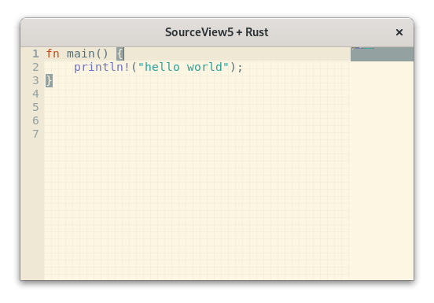

# sourceview5-rs 

[Gtk SourceView 5](https://gitlab.gnome.org/GNOME/gtksourceview/) Rust bindings

    

A small demo is available in the [demo](./demo) subdirectory.

## Documentation

- [sourceview5](https://bilelmoussaoui.github.io/sourceview5-rs/sourceview5/)
- [sourceview5-sys](https://bilelmoussaoui.github.io/sourceview5-rs/sourceview5_sys/)